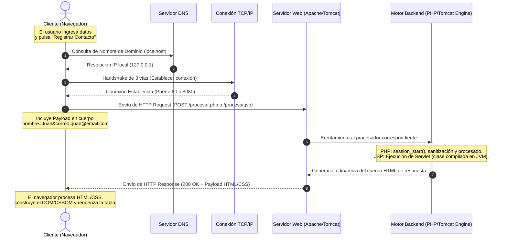

Integrantes

- Coca Huari Mario
- Carbajal Arana Alexander
- Castro Ordoñes Erick
- Ramos Mercado Vasco
- Rojas Quispe Rolando


# Guía Práctica de Desarrollo Web Fullstack - Semana 09
## Sistema de Registro de Contacto (PHP vs JSP)

Este repositorio contiene la solución completa para la **Guía Práctica Grupal de la Semana 09** de la asignatura **Desarrollo de Aplicaciones Web (IS093A)** de la Universidad Nacional del Centro del Perú (UNCP).

El proyecto implementa un **Sistema de Registro de Contactos** utilizando dos tecnologías backend de gran relevancia histórica y comercial: **PHP** y **JSP (Java Server Pages)**. Ambas aplicaciones comparten un diseño visual premium común (responsive, tema oscuro, gradientes dinámicos y efectos visuales de interacción), lo que permite contrastar directamente las diferencias arquitectónicas en su backend.

---

## 📂 Estructura del Entregable

La estructura de carpetas implementada en este proyecto es la siguiente:

```text
semana 9/
│
├── php-app/                    # Aplicación Backend PHP (Servidor Apache / XAMPP)
│   ├── css/
│   │   └── style.css           # Estilos Premium de la interfaz PHP
│   ├── index.html              # Formulario de Registro en HTML5
│   └── procesar.php            # Lógica de validación, sanitización y renderizado PHP
│
├── jsp-app/                    # Aplicación Backend JSP (Servidor Tomcat)
│   ├── css/
│   │   └── style.css           # Estilos Premium de la interfaz JSP (réplica de PHP)
│   ├── WEB-INF/
│   │   └── web.xml             # Descriptor de despliegue de la aplicación web
│   ├── index.jsp               # Formulario de Registro en JSP
│   ├── error.jsp               # Página de visualización de errores (405, 400)
│   └── procesar.jsp            # Lógica en Java, sesión y renderizado JSP
│
├── Guia_Practica_Semana_9_-_Grupal.pdf  # Archivo de especificaciones
└── README.md                   # Esta documentación técnica completa
```

---

## 1. 🔄 Flujo del Ciclo HTTP (Cliente ↔ Servidor)

Cuando un usuario interactúa con la aplicación (por ejemplo, al registrar un contacto), la información realiza un viaje completo a través de la infraestructura cliente-servidor. A continuación se detalla y grafica este flujo:



### Explicación Paso a Paso del Flujo:
1. **Acción del Cliente (Navegador)**: El usuario completa el formulario y presiona el botón. Las validaciones nativas de HTML5 evitan campos vacíos o correos inválidos antes de que la petición sea enviada.
2. **Resolución DNS**: El navegador consulta la dirección IP correspondiente a `localhost`. El sistema operativo devuelve la IP de loopback `127.0.0.1`.
3. **Acuerdo TCP/IP (Handshake)**: El cliente abre un socket TCP y realiza la negociación de tres pasos (*SYN, SYN-ACK, ACK*) en el puerto del servidor (generalmente puerto `80` para Apache y `8080` para Tomcat).
4. **Envío de HTTP Request (POST)**: Se transmite el request HTTP empaquetado. Al ser un método `POST`, la información sensible viaja de manera oculta dentro del cuerpo de la petición (`Body Payload`), previniendo fugas en los logs de URLs.
5. **Recepción en Servidor Web**: Apache (para PHP) o Tomcat (para JSP) recibe la petición a través de sus sockets de escucha.
6. **Ejecución en Motor Backend**:
   - **En PHP**: El módulo de PHP inicia o continúa la sesión mediante `session_start()`, lee `$_POST`, sanitiza caracteres especiales con `htmlspecialchars()` para prevenir ataques de scripting (XSS), valida el correo electrónico y lo almacena en un array dentro de `$_SESSION`.
   - **En JSP**: Tomcat direcciona el request al Servlet mapeado (o a la página compilada temporalmente). Se recupera la `HttpSession`, se validan los parámetros y se agrega el contacto a una lista de mapas dinámica, la cual se persiste en la sesión. Para evitar XSS en el HTML resultante, se realiza un escapado de caracteres especiales.
7. **Retorno de HTTP Response**: El servidor responde al cliente enviando cabeceras estándar (ej. `Content-Type: text/html`, `Status Code: 200 OK`) junto con el cuerpo de la página HTML resultante que contiene la tabla actualizada.
8. **Renderizado en el Cliente**: El motor de renderizado del navegador (*Blink, Gecko, WebKit*) procesa la estructura HTML, aplica las reglas CSS contenidas en `style.css` y pinta la interfaz visual moderna en pantalla.

---

## 2. 📊 Matriz Comparativa Técnica: PHP vs JSP

La siguiente tabla describe de forma técnica y comparativa el comportamiento interno de ambas tecnologías backend:

| Dimensión Técnica | PHP (Hypertext Preprocessor) | JSP (Java Server Pages) |
| :--- | :--- | :--- |
| **Ciclo de Vida** | **Share-Nothing**: Cada petición HTTP inicia la ejecución del script desde la línea 1 y muere al terminar la respuesta. No persiste en memoria global del servidor de forma nativa. | **Persistent Servlet**: El archivo JSP se traduce a un Servlet de Java (`.java`) y se compila a bytecode (`.class`) en la primera petición. Persiste en memoria (JVM) atendiendo peticiones concurrentes mediante hilos (*threads*). |
| **Rendimiento** | **Rápido al inicio**: Ideal para peticiones rápidas. La interpretación tiene un costo, aunque se mitiga drásticamente hoy en día usando **OPcache** (caché de código precompilado). | **Lento al primer acceso** (fase de compilación del Servlet), pero **sumamente veloz** en las siguientes ejecuciones gracias al motor de la JVM y a la ejecución de código Java nativo en caché de memoria. |
| **Despliegue** | **Inmediato**: Solo se copian los archivos `.php` a la carpeta pública (`htdocs`). El intérprete de Apache compila y ejecuta el script al vuelo. | **Estructurado**: Requiere un contenedor de servlets (Tomcat). Los archivos se empaquetan en un archivo `.war` o en una estructura de carpetas específica (`webapps/`) gestionada por un descriptor de despliegue (`web.xml`). |
| **Gestión de Estado** | Descentralizado o a disco: `session_start()` guarda el estado de la sesión por defecto en archivos temporales del servidor de forma serializada. Se identifica mediante la cookie `PHPSESSID`. | Almacenamiento en Memoria (Heap): La interfaz `HttpSession` mantiene los objetos Java activos en la memoria RAM asignada a la JVM. Se identifica a través de la cookie `JSESSIONID`. |
| **Seguridad de Tipos** | Débilmente tipado (dinámico). PHP 8 introduce tipado opcional, lo cual simplifica la escritura pero puede incurrir en errores de coherencia en tiempo de ejecución si no se gestiona de forma adecuada. | Fuertemente tipado (estático). Java previene múltiples fallos en tiempo de compilación y garantiza una robustez superior en sistemas complejos y a gran escala. |
| **Seguridad XSS** | Implementada mediante funciones de escape nativas (`htmlspecialchars()`, `filter_input()`, `strip_tags()`) que deben llamarse de forma explícita al renderizar. | Resuelta de forma nativa mediante la biblioteca de etiquetas JSTL (`<c:out>`) o mediante funciones custom de escape en Java que limpian los caracteres especiales antes de inyectarlos al HTML. |
| **Madurez del Ecosistema**| Altamente maduro, dominante en la web clásica (WordPress, Drupal, Laravel, Symfony). Ecosistema inmenso y facilidades de hosting económico. | Altamente corporativo y empresarial. Parte de la especificación Jakarta EE (antiguo J2EE), con soporte de gigantes industriales y de frameworks potentes (Spring, Hibernate). |

---

## 3. 🛡️ Seguridad Básica Implementada

Ambas aplicaciones se han programado aplicando directrices estrictas de desarrollo seguro:
1. **Prevención de XSS (Cross-Site Scripting)**:
   - En PHP se utiliza `htmlspecialchars($data, ENT_QUOTES, 'UTF-8')` antes de concatenar las cadenas de texto del usuario en el navegador. Esto convierte caracteres potencialmente peligrosos como `<` o `>` en entidades seguras (`&lt;` y `&gt;`).
   - En JSP se programó una función robusta `escapeHtml()` en una directiva declarativa de Java (`<%! %>`), de tal modo que cualquier inyección maliciosa en los campos de texto del formulario sea neutralizada antes del renderizado de la tabla de registros.
2. **Validación del Método HTTP**:
   - Ambas aplicaciones rechazan cualquier petición que no provenga del método `POST` (como peticiones directas de tipo `GET` escribiendo la URL en el navegador).
   - Se devuelve el código de estado estándar **HTTP 405 (Método No Permitido)** junto con una vista estilizada de error.
3. **Validación de Datos**:
   - Se valida la existencia de los campos.
   - El correo electrónico se valida estrictamente usando expresiones regulares y filtros del sistema antes de aceptarse en la sesión. Si falla, se devuelve un código **HTTP 400 (Petición Incorrecta)**.

---

## 4. 🚀 Guía de Despliegue Paso a Paso (para el Usuario)

Dado que los servidores corren de forma local en tu máquina, sigue estas instrucciones detalladas para levantar las aplicaciones utilizando **XAMPP** (para PHP) y **Apache Tomcat** (para JSP):

### Parte A: Despliegue de la Aplicación PHP (XAMPP / Apache)

1. **Instalación de XAMPP**:
   - Si no lo tienes, descarga e instala XAMPP para Windows desde el sitio oficial.
2. **Copiar los archivos**:
   - Copia la carpeta completa `php-app` de este proyecto y pégala dentro del directorio de despliegue de Apache:
     `C:\xampp\htdocs\php-app`
3. **Iniciar Apache**:
   - Abre el **Panel de Control de XAMPP** (XAMPP Control Panel) y haz clic en el botón **Start** al lado del módulo **Apache**. El botón cambiará a color verde y se asignarán los puertos (normalmente `80` y `443`).
4. **Probar en el Navegador**:
   - Abre tu navegador web y escribe la siguiente dirección:
     `http://localhost/php-app/index.html`
   - Completa el formulario con datos de ejemplo y haz clic en "Registrar Contacto". Verás la pantalla con la tabla estilizada.

---

### Parte B: Despliegue de la Aplicación JSP (Apache Tomcat)

1. **Instalación de Apache Tomcat**:
   - Descarga e instala Apache Tomcat (se recomienda la versión 9 o 10 compatible con la especificación de Servlets de tu entorno).
2. **Copiar los archivos**:
   - Copia la carpeta completa `jsp-app` de este proyecto y pégala dentro del directorio de aplicaciones web de Tomcat:
     `C:\Program Files\Apache Software Foundation\Tomcat X.Y\webapps\jsp-app`
     *(Nota: si instalaste Tomcat de forma portable, cópiala en la carpeta `/webapps` de tu Tomcat portable).*
3. **Iniciar Tomcat**:
   - **Opción A**: Abre la consola de servicios de Windows (`services.msc`), busca el servicio **Apache Tomcat** y haz clic en **Iniciar**.
   - **Opción B**: Si utilizas la versión portable o de consola, abre una terminal de comandos en la carpeta de Tomcat (`C:\...\Tomcat\bin`), y ejecuta el script:
     `startup.bat`
4. **Probar en el Navegador**:
   - Por defecto, Tomcat escucha en el puerto `8080`. Abre tu navegador y accede a:
     `http://localhost:8080/jsp-app/index.jsp`
   - Prueba ingresando un contacto y observa cómo se persiste en la sesión del servidor Java.

---

## 5. 🔍 Guía para Obtener Capturas y Logs (QA & Documentador)

Para completar al 100% tu entrega y adjuntar las evidencias en el reporte grupal, realiza los siguientes pasos prácticos:

### 1. Capturas del Sistema Funcionando
- Entra a `http://localhost/php-app/index.html` y registra un contacto. Toma una captura de pantalla del formulario lleno y otra de la tabla con los registros en PHP.
- Entra a `http://localhost:8080/jsp-app/index.jsp`, ingresa un contacto y captura la pantalla de resultados con la tabla en JSP.

### 2. Capturas de Respuestas HTTP (Pestaña Red)
- En tu navegador, presiona la tecla `F12` para abrir las Herramientas de Desarrollador.
- Ve a la pestaña **Red** (Network).
- Envía el formulario de contacto.
- Selecciona el recurso `procesar.php` o `procesar.jsp` de la lista de peticiones capturadas.
- Toma capturas de:
  - **Cabeceras (Headers)**: Donde se muestre `Request Method: POST`, `Status Code: 200 OK`, y la cookie (`PHPSESSID` o `JSESSIONID`).
  - **Carga Útil (Payload / Request Body)**: Donde se visualice la información enviada (`nombre` y `correo`).

### 3. Captura de Errores (405 y 400)
- Escribe directamente `http://localhost/php-app/procesar.php` en la barra del navegador (esto realiza una petición de tipo `GET`). Captura la pantalla de error **405 Método No Permitido** y observa en la pestaña Red el código HTTP 405.
- Envía un correo con formato incorrecto o un nombre vacío y captura la pantalla de error **400 Datos Inválidos**.

### 4. Ubicación de Logs de Servidores
- **Apache (PHP) Logs**:
  - Abre los archivos en: `C:\xampp\apache\logs\access.log` (registro de accesos HTTP) y `error.log` (errores de ejecución PHP).
  - Identifica la línea de tu petición `POST /php-app/procesar.php HTTP/1.1 200` y toma una captura o copia el texto para tu entrega.
- **Tomcat (JSP) Logs**:
  - Abre el archivo en: `C:\Program Files\Apache Software Foundation\Tomcat X.Y\logs\localhost_access_log.YYYY-MM-DD.txt` (donde `YYYY-MM-DD` es la fecha de hoy).
  - Busca la línea correspondiente a tu petición `POST /jsp-app/procesar.jsp HTTP/1.1 200` y regístrala como evidencia en tu informe.
